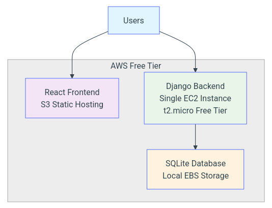
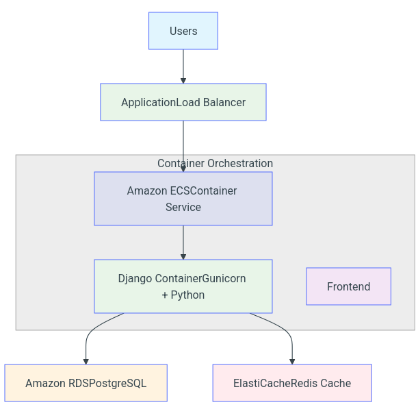

# Volmir - Cloud Computing Final Project

## Installation

Clone the repository from GitHub:
```bash
git clone <repo>
```
Navigate to the project directory and install dependencies:
```bash
poetry install
```
## Running the Application
Run database migrations:
```bash
python3 manage.py migrate 
```
Start the development server:
```bash
python3 manage.py runserver 
```
## Accessing the August 14th Presentation
Navigate to the documentation directory:
```bash
cd documentation
```
Build and serve the presentation locally:
```bash
mkdocs build
mkdocs serve -a 127.0.0.1:8001
```
Alternatively, the presentation files are available directly in the documentation directory.

## Frontend Setup
This repository contains the backend only. The frontend is available at [Frontend](https://github.com/Volmir-project/volmir-dashboard). 
To set up the frontend:
```bash
git clone <frontend-repo>
npm install 
npm run dev
```

## Running with Docker
Make the start script executable and run:
```bash
chmod +x ./start-docker.sh
sudo ./start-docker.sh
```
## Terraform
Terraform is located in directory `terraform`.

## Github Issues
I have used organization in GitHub, so it is a little bit different the a repo. [Issues](https://github.com/orgs/Volmir-project/projects/2)

## Testing
Tests can be run manually through the GitHub Actions interface.
Test coverage includes:
- Creating users, tasks, and posts
- Deleting, editing, and fetching operations

# Architectures


### Infrastructure

- React application would be built and deployed to Amazon S3
- Django application would be deployed on a single EC2 t2.micro instance
- SQLite database file would be stored locally on the EC2 instance's EBS volume


### Deployment



1. Frontend Deployment: 
    - Would build React application using `npm run build`
    - Would upload static files to S3 bucket configured for static website hosting

2. Backend Deployment:
    - Would use EC2 instance running Amazon Linux 2

3. Database Management: 
    - SQLite database would be automatically created during Django migrations 

## Tradeoffs
### Advantages 
- Entire stack would run at zero cost
- Minimal components, easy deployment
- SQLite with local storage eliminates network latency
- Perfect for prototypes and proof of concepts

### Risks
- EBS failure = database gone
- SQLite struggles with concurrent writes
- One EC2 instance
- High traffic causes database lock errors

**It would be good to migrate to alternative infrastructures if app has several users.**

## Alternative Architecture



### Container Architecture Benefits

- ECS would automatically scale containers based on demand
- Load balancer would distribute traffic across multiple container instances
- Docker containers would ensure identical environments from development to production
- Containers would use fewer resources than full virtual machines
- Container images would enable simple, repeatable deployments