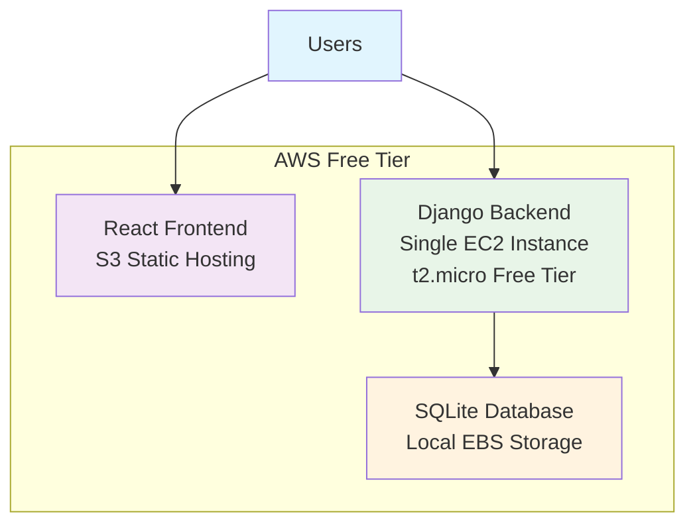
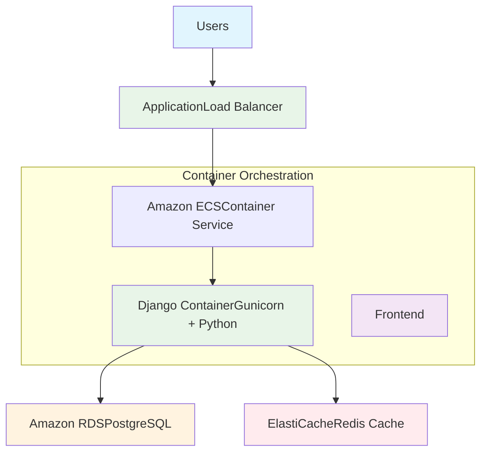

# Final Project

## Idea 

Habits are hard to follow if you are not held accountable, this app solves that by providing a platform where users can track their daily habits, set goals, and maintain consistency through accountability features.

## Architecture

### Frontend
- React.js with built-in and custom hooks and functional components
- Main Components:
    - User Profile
    - Calendar.
- Styling: Chakra UI with custom components
- HTTP Client: Axios for API communication with the Django backend

### Backend
- Django with Django REST Framework for API development
- Would be hosted on AWS EC2 instance using the free tier (t2.micro) 
- SQLite for simple data storage
- RESTful API design handling CRUD operations
- Django's built-in authentication system with token-based authentication for secure user sessions

## Cloud Architecture

### Infrastructure

- React application would be built and deployed to Amazon S3
- Django application would be deployed on a single EC2 t2.micro instance
- SQLite database file would be stored locally on the EC2 instance's EBS volume

### Deployment

1. Frontend Deployment: 
    - Would build React application using `npm run build`
    - Would upload static files to S3 bucket configured for static website hosting

2. Backend Deployment:
    - Would use EC2 instance running Amazon Linux 2

3. Database Management: 
    - SQLite database would be automatically created during Django migrations 

## Tradeoffs
### Advantages 
- Entire stack would run at zero cost
- Minimal components, easy deployment
- SQLite with local storage eliminates network latency
- Perfect for prototypes and proof of concepts

### Risks
- EBS failure = database gone
- SQLite struggles with concurrent writes
- One EC2 instance
- High traffic causes database lock errors

**It would be good to migrate to alternative infrastructures if app has several users.**

## Alternative Infrastructure

### Container Architecture Benefits

- ECS would automatically scale containers based on demand
- Load balancer would distribute traffic across multiple container instances
- Docker containers would ensure identical environments from development to production
- Containers would use fewer resources than full virtual machines
- Container images would enable simple, repeatable deployments
